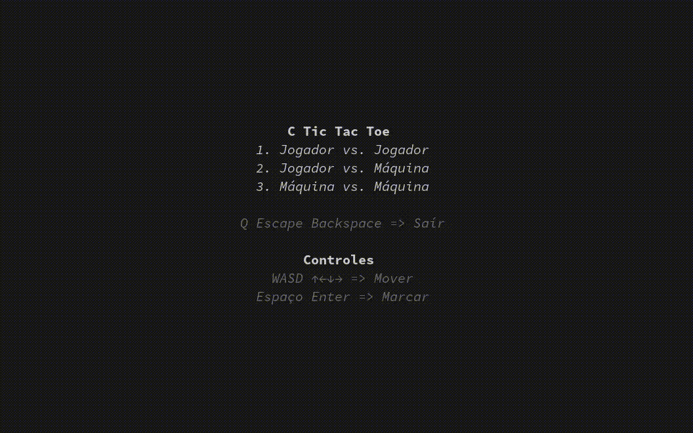

# C Tic Tac Toe

Um Jogo da Velha escrito em um único
arquivo C usando C99, POSIX e Win32.
---

A ideia desse programa é ser algo para ser estudado por qualquer
pessoa interessada na linguagem C.

O arquivo: [`ctictactoe.c`](./ctictactoe.c)

O programa é dedicado ao **domínimo público**, veja [`LICENSE`](./README.md)
